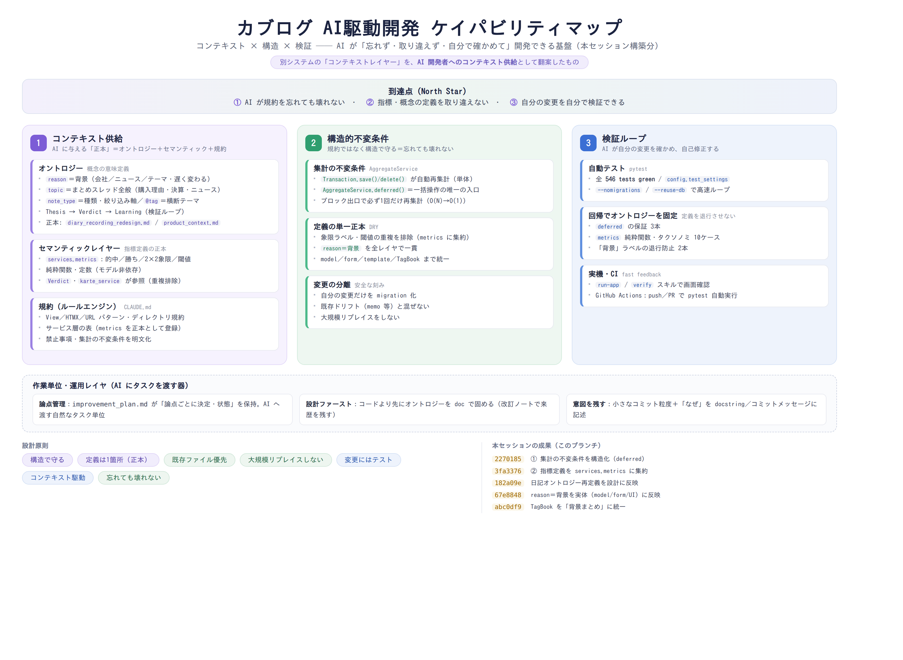

# AI駆動開発の考え方

カブログを **AI（Claude Code）で安全に・速く開発し続ける**ための設計思想と原則。
本ドキュメントが正本。図はその視覚的サマリー。



---

## 1. 核心思想：AI開発者に「コンテキストレイヤー」を供給する

AI駆動開発の設計とは、突き詰めると **AI開発者に良いコンテキストを与え、AIが間違えても壊れない構造にし、AIが自分で確かめられるようにすること**。

着想は別システムの「コンテキストレイヤー」図（企業データ基盤が AIエージェントに *オントロジー＋指標定義＋関係＋判断文脈* を供給する設計）。これを**プロダクトの機能ではなく、リポジトリ自身が Claude Code に供給すべきコンテキスト**として翻案すると、ちょうど後述の3本柱になる。

> 重要：これは「人間の良い開発」とほぼ同じ。ただし AI は **コンテキストが有限で、規約を忘れ、定義を再発明しがち**なので、人間なら暗黙で許される曖昧さが AI では事故になる。だから *構造と正本* に倒す投資対効果が、AI駆動開発では一段高い。

## 2. 到達点（North Star）

1. **AI が規約を忘れても壊れない**（構造で守る）
2. **指標・概念の定義を取り違えない**（正本＝オントロジー／セマンティック）
3. **自分の変更を自分で検証できる**（検証ループ）

## 3. 三本柱

| 柱 | 意味 | 主な実体 |
|---|------|----------|
| **① コンテキスト供給** | AI に与える「正本」 | オントロジー（`reason＝背景`／`topic＝まとめスレッド`／`note_type＝種類軸`／Thesis→Verdict→Learning）・`stockdiary/services/metrics.py`（指標定義の正本）・`CLAUDE.md`（規約） |
| **② 構造的不変条件** | 規約ではなく構造で守る | `AggregateService.deferred()`（一括操作の唯一の入口）・`Transaction.save()/delete()` の自動再集計・定義の単一正本（DRY）・変更の分離（migration） |
| **③ 検証ループ** | AI が自分で確かめ自己修正 | pytest（全 green）・回帰でオントロジーを固定・`run-app`/`verify`/`security-review` スキル・GitHub Actions（テスト＋無料セキュリティ検知） |

底の帯は「作業単位・運用レイヤ」（`improvement_plan.md` の論点管理／設計ファースト／意図を残すコミット）。

## 4. 原則（このセッションで実証した具体つき）

### 原則1：不変条件は「規約」から「構造」へ昇格する
ドキュメントの「必ず◯◯せよ」はメモリ任せ＝AI も人間も忘れる。**忘れても壊れない構造**に作り替える。
- 例：取引の一括操作後の再集計を、規約ではなく `AggregateService.deferred()` という*唯一の入口*に。ブロックを抜ければ必ず1回再集計が走る（呼び忘れても集計がずれない）。

### 原則2：定義は1箇所に集約する（正本を作る）
同じ概念・指標が複数箇所にあると、AI が片方だけ直して**定義がドリフト**する。意味の定義は1つの正本に寄せる。
- 例：意思決定の質の指標（的中／勝ち／2×2象限／閾値）を `services.metrics` に集約。`Verdict`・`karte_service` は参照するだけ。
- 例：`reason＝背景` のオントロジーを model／form／全テンプレート／TagBook まで一貫させ、`投資理由` という語を一掃。

### 原則3：コードより先にコンテキストを固める（設計ファースト）
AI に実装させる前に、**オントロジー（概念の意味）を文章で確定**する。曖昧なまま書かせると、もっともらしく間違える。
- 例：`reason＝背景／topic＝まとめスレッド` の再定義を、まず `diary_recording_redesign.md` 改訂2 に反映してから実体（コード）を揃えた。

### 原則4：変更にはテストを添え、定義をコードで固定する
テストは「正解の定義」。回帰テストはオントロジー・不変条件が**退行しないための錨**。
- 例：`deferred` の保証3本、`metrics` のタクソノミ10ケース、`reason` ラベルが「背景」であることを固定する2本。

### 原則5：小さく・分離して・既存を壊さず刻む
既存ファイル優先、大規模リプレイスをしない、変更を混ぜない。AI の編集の局所性と安全性が上がる。
- 例：migration は `reason` の verbose_name だけにし、検出された既存ドリフト（memo 削除等）は**別件として含めない**。

### 原則6：意図を残す（なぜ）
AI は「なぜそうしたか」を docstring／コミットメッセージ／改訂ノートから読む。意図がないコードは将来の AI を迷わせる。
- 例：各サービスの docstring に役割と境界、コミットに背景と判断、doc に「改訂2」の動機を明記。

### 原則7：コストの境界を設計に織り込む
「AIの力」を使うときも従量課金に落ちない経路を選ぶ。
- 例：脆弱性検知は、API直結（per-token課金）ではなく**公開リポジトリ無料の CodeQL/Copilot** と **定額の Claude Code `/security-review`** で構成（→ `docs/security_scanning.md`）。

## 5. アンチパターン（避ける）

- 規約をドキュメントだけに置き、強制をメモリ任せにする
- 同じ概念・指標を複数箇所で定義する（ドリフトの温床）
- 巨大ファイル（例：`views.py` 3,600行）＝AI のコンテキスト効率と編集安全性を下げる
- AI に実装させてから設計を後付けする（もっともらしい誤りが入る）
- AI API を CI に直結する＝従量課金

## 6. このセッションの証跡（原則 → コミット）

| コミット | 内容 | 主に効いた原則 |
|---|---|---|
| `2270185` | 集計の不変条件を構造化（`deferred`） | 原則1・4 |
| `3fa3376` | 指標定義を `services.metrics` に集約 | 原則2・4 |
| `182a09e` | 日記オントロジー再定義を設計に反映 | 原則3 |
| `67e8848` / `abc0df9` | `reason＝背景` を実体（model/UI/TagBook）へ一貫 | 原則2・5 |
| `620a933` | ケイパビリティマップを追加 | 原則6 |
| `c4b54c0` / `e525417` | 無料セキュリティ検知スタック | 原則7・③検証ループ |

## 7. 残課題・次の一手

- `views.py`（3,600行）の責務別分割（原則5・コンテキスト効率）
- 購入理由 `topic` スレッドの低摩擦化（自動スレッド化）と検証期日の帰属（→ `diary_recording_redesign.md` §5-K）
- Bandit / pip-audit を advisory から段階的に厳格化（→ `docs/security_scanning.md`）

## 関連ドキュメント

- オントロジー（reason＝背景／topic）の確定: `docs/diary_recording_redesign.md`
- プロダクトの判断軸: `docs/product_context.md`
- 成長OS（Thesis→Verdict→Learning）: `docs/growth_os_redesign.md`
- 指標定義の正本: `stockdiary/services/metrics.py`
- セキュリティ検知（従量課金なし）: `docs/security_scanning.md`

---

## 図の再生成

図は `docs/assets/ai_driven_development.html` を正本とし、ヘッドレス Chromium で PNG 化する。

```bash
chromium --headless --no-sandbox --disable-gpu --hide-scrollbars \
  --force-device-scale-factor=2 --window-size=1640,1200 \
  --screenshot=docs/assets/ai_driven_development.png \
  "file://$PWD/docs/assets/ai_driven_development.html"
```

内容を更新するときは HTML を編集してから上記を再実行する（PNG は生成物）。
